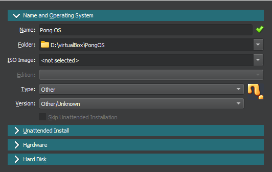
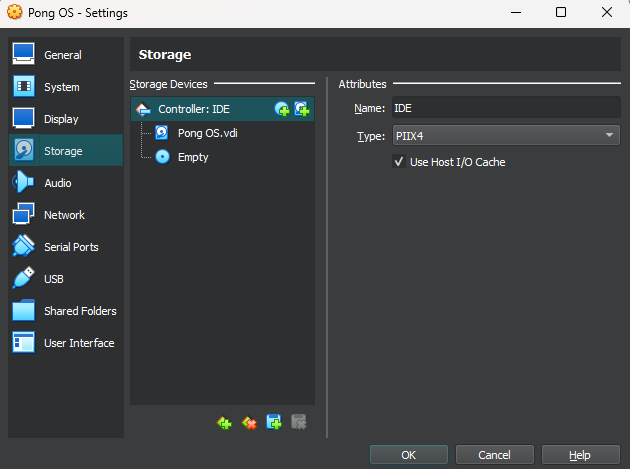
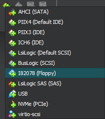
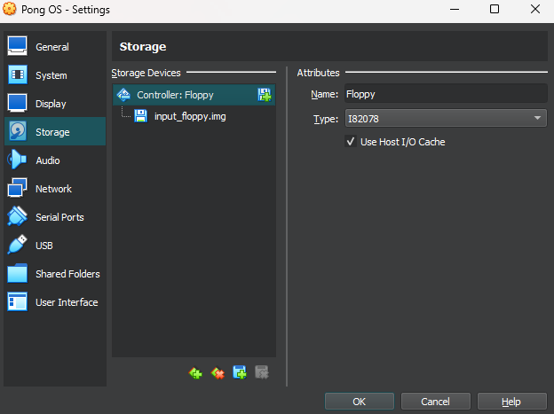

# Pong Game In Boot Sector

## This game is an extended version of the code written by [Sudocpp]
* [Check his playlist for more indepth understanding]

## How to play

* Make sure to have virtual box or qemu installed in your device. (Recommended - qemu)

### If Using Qemu

* Give execution permission to the run.sh file by using chmod +x run.sh

* Execute the run.sh file by using ./run.sh

* A virtual machine will boot up with the pong game running in it.

* Use the 'W' and 'S' keys and 'Up Arrow' and 'Down Arrow' keys to control the respective
   paddle

### If Using Virtual box
* Create a new virtual box with the following settings.

* In the settings remove the default storage controller.

* Add a new contrller with the Floppy.

* Select the input_floppy.img from the build folder.

* Press ok to save the settings and start the virtual machine.

* Use the 'W' and 'S' keys and 'Up Arrow' and 'Down Arrow' keys to control the respective
   paddle

## To make changes

* Change the code in the input.asm file.

* Make the build files using the make command. (simply enter 'make' in the root directory terminal)

* Test accordingly using the above mentioned methods.

[Sudocpp]: https://www.youtube.com/@sudocpp
[Check his playlist for more indepth understanding]: https://www.youtube.com/playlist?list=PLsCsQorDHC9WyHj458UFxUaAerg4UiyjY